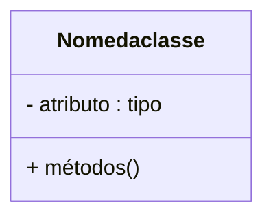

# Conselho do Recursos Humanos - Backend

 

    

  

## 1. Descrição

Descrevendo o projeto...

------

## 2. Sobre esta API

<strong>Nest (NestJS)</strong> é uma estrutura para a construção de aplicativos Node.js do lado do servidor eficientes e escalonáveis. Ele usa JavaScript progressivo, é construído e oferece suporte total a TypeScript (mas ainda permite que os desenvolvedores codifiquem em JavaScript puro) e combina elementos de OOP (Programação Orientada a Objetos), FP (Programação Funcional) e FRP (Programação Funcional Reativa).
Nos bastidores, o Nest faz uso de estruturas robustas de servidor HTTP como o Express (o padrão) e, opcionalmente, pode ser configurado para usar o Fastify também!

O Nest fornece um nível de abstração acima desses Node.js comuns frameworks (Express/Fastify), mas também expõe suas APIs diretamente ao desenvolvedor. Isso dá aos desenvolvedores a liberdade de usar uma infinidade de módulos de terceiros disponíveis para a plataforma subjacente.

### 2.1. Principais Funcionalidades

1. Liste as principais funcionalidades e as features especiais

------

## 3. Diagrama de Classes

------

## 4. Diagrama Entidade-Relacionamento (DER)

Adicione a imagem do Diagrama

    

------

## 5. Tecnologias utilizadas

| Item                          | Descrição  |
| ----------------------------- | ---------- |
| **Servidor**                  | Node JS    |
| **Linguagem de programação**  | TypeScript |
| **Framework**                 | Nest JS    |
| **ORM**                       | TypeORM    |
| **Banco de dados Relacional** | MySQL      |

------

## 6. Configuração e Execução

1. Clone o repositório
2. Instale as dependências: `npm install`
3. Configure o banco de dados no arquivo `app.module.ts`
4. Execute a aplicação: `npm run start:dev`

------

## 7. Colaboradores
